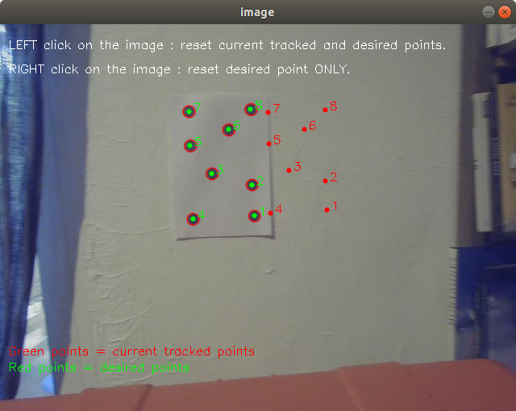

# marineMechatronicsMir
code for marine mecatronics class Master Mir

## Visual servoing code

The visual servoing class will be based on two steps :
* visual blob tracking to ge 2D points position 
* visual servoing

### Install 

install scipy
```
sudo apt-get install python-numpy python-scipy python-matplotlib ipython ipython-notebook python-pandas python-sympy python-nose
```

upgrade scipy to version 1.2.0 to use rotation

```
pip install scipy==1.2.0
```

go to you catkin workspace :
  ```
  cd ~/catkin_ws
  cd src
  ```
 
clone the repo : 
  ```
  git clone https://github.com/cosmer-admin/autonomous_rov.git
  ```

source your catkin workspace : 
  ```
  source devel/setup.bash
  ```
### Test 

#### test it on a bag

Set the env variable in you bashrc

```
 gedit ~\.bashrc
```
And edit those lines

export ROS_MASTER_URI=http://127.0.0.1:11311
export ROS_HOSTNAME=127.0.0.1
export ROS_IP=127.0.0.1

1. open a new terminal and run the bag testtracking.bag with loop option so that it never stops publishing

```
  cd ~/catkin_w/src/autonomous_rov/bags
  rosbag play -l  testtracking.bag
```

3. open a terminal and run a roscore

```
   roslaunch autonomous_rov run_visual_servoing.launch
```

4. open another terminal and run the launch file
```
   roslaunch autonomous_rov run_visual_servoing.launch
```

5. look at the topic : you should see two new topics : 
  - /br5/tracked_points of type std_msgs/Float64MultiArray
  - /br5/desired_points of type std_msgs/Float64MultiArray
They are published by the node blob_tracker_mir.py. They contained the point position in the image in pixels : \[u1,v1,u2,v2,u3,v3,....,uN, vN\]
They are listened in the node visual_servoing_mir.py.
 
#### Real robot application

1. Set your network to 
```
IPv4 to be adress = 192.168.254.15 Netmask = 255.255.255.0 Gateway = [empty]
```
**Be carreful that your firewall is off**

2. Set the env variable in you bashrc 
```
 gedit ~\.bashrc
```
And edit those lines
```
export ROS_MASTER_URI=http://192.168.254.15:11311
export ROS_HOSTNAME=192.168.254.15
export ROS_IP=192.168.254.15
```

3. You have to change the group name in the launch file to adapt it to your robot topic. 

Open the file run_visual_servoing.launch
```
  gedit ~/catkin_ws/src/autonomous_rov/launch/run_visual_servoing.launch
 ``` 
Change Line 11 with your rov number. Replace br5 with br1 , br2 , br3 or br4 ...
```
  line 11 <group ns="br5">
```
4. open a terminal and run a roscore
```
   roslaunch autonomous_rov run_visual_servoing.launch
```
5. open another terminal and run the launch file
```
   roslaunch autonomous_rov run_visual_servoing.launch
```
6. look at the topic : you should see two new topics : 
  - /br5/tracked_points of type std_msgs/Float64MultiArray
  - /br5/desired_points of  type std_msgs/Float64MultiArray
They are published by the node blob_tracker_mir.py. They contained the point position in the image in pixels : \[u1,v1,u2,v2,u3,v3,....,uN, vN\]
They are listened in the node visual_servoing_mir.py.


### Points tracking 

This part is based on the simple blob tracker of open CV : [Find code and exaplanation here]([https://pages.github.com/](https://learnopencv.com/blob-detection-using-opencv-python-c/))
It detects and unicolor dots in an image and return their center in pixels.


The image displays 
  - the current tracked points in green 
  - the desired point in red that will be used in visual servoing

The order of the points is set at the beginning of the tracking algorithm according to the first point detected by the algorithm.

Tracked point and desired point might be ordered identically.
That is why when you reset the tracking, the desired points are also tracked. 

The tracking is monitored by clicking in the image.
  - Right click on the image to update the desired points
  - Left click on the image to initialise the tracked points and reset the desired point



If there is too much offset between two successive detections, the algorithm issues a warning and the editor stops until you click on the image to reset the desired point and track.


 
 
 

